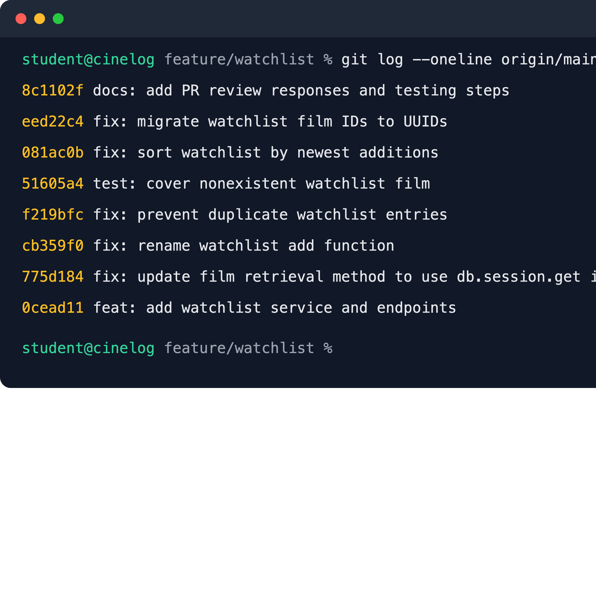

# PR Response Doc — CineLog Watchlist Feature

## AI Usage

I used Codex to help orient me to the repository, compare the watchlist service
with the existing collection service, and check my work against the six review
comments. I verified its suggestions by reading the source files and running the
tests myself. I also used it as a devil's advocate for the visibility and sort
order decisions; this helped me make the privacy and discoverability tradeoffs
more explicit instead of treating either default as universally correct. Its
counterargument was that a public default could expose a list a user considers
personal, so my final response adds the need for clear per-entry and
account-level privacy controls. For sorting, it pointed out that alphabetical
order helps on long lists; I kept newest-first but addressed that need with a
future search or optional sort control. Finally, I used Codex to review the Git
log for conventional prefixes and logical commit boundaries, then checked the
messages myself against `CONTRIBUTING.md`.

## Comment 1 — Rename

**What I did:** I renamed `save_to_watchlist()` to `add_to_watchlist()` in
`services/watchlist_service.py` so it follows the same `verb_to_noun` convention
as `add_to_collection()`. I updated the import and call in
`routes/watchlist/watchlist.py`, then searched the whole project for the old
name to make sure there were no missed call sites.

**How I verified:** I ran the full test suite after the rename and confirmed
that the application imports still worked.

## Comment 2 — Deduplication

**What I did:** I followed the pattern in `add_to_collection()`: after checking
that the film exists, `add_to_watchlist()` queries for an entry with the same
`user_id` and `film_id`. If one exists, it raises a dedicated
`AlreadyInWatchlistError` before creating or committing another row.

**How I verified:** I ran the full test suite and manually exercised the service
in the test application context by adding the same film twice. The second call
raised `AlreadyInWatchlistError`, and the database still contained one matching
watchlist entry.

## Comment 3 — Missing test

**What I did:** I created `tests/test_watchlist.py` and modeled its app fixture,
sample-user fixture, and `pytest.raises` assertion on
`test_add_to_collection_nonexistent_film_raises`. The new test calls
`add_to_watchlist()` with a UUID that is not in the film table and expects
`FilmNotFoundError`.

**How I verified:** I first ran `pytest tests/test_watchlist.py -v`, then ran
`pytest tests/ -v` to check the new test together with the collection tests.

## Comment 4 — Default visibility

**My position:** I would keep `public=True` as the default for new watchlist
entries.

**Reasoning:** CineLog is a social film log, so I am optimizing for easy sharing
and discovery. A public default lets friends see what someone hopes to watch
without requiring that user to change the visibility of every new entry. It
also makes watchlists useful as recommendation lists immediately after films
are added. This is an intentional product default, not just the value that was
already in the model.

**Tradeoff acknowledged:** A private default would better protect users who
treat a watchlist as personal and would reduce accidental sharing. Public by
default therefore needs a clear visibility control in the client and a future
account-level default so privacy-conscious users can opt out once instead of on
every entry. If CineLog's product direction becomes private journaling rather
than social discovery, I would reverse this default.

## Comment 5 — Sort order

**My position:** I changed the watchlist to sort by `date_added` descending, so
the newest additions appear first.

**Reasoning:** A watchlist is usually a queue of future viewing ideas. Recent
adds are more likely to reflect what a user currently wants to watch, and
putting them first avoids making the user remember an exact title before the
list can help them. This also matches the existing collection service's
newest-first convention.

**Engagement with reviewer's point:** I agree that recency is the stronger
default for the behavior the reviewer described. Alphabetical order would be
better for locating a known title in a long list, but that need is better served
by search or an optional sort control. The default should support browsing
recent intent, so I implemented the maintainer's preference.

## Comment 6 — Rebase

**What conflicted:** I fetched `origin/main` and rebased `feature/watchlist` on
it. Git did not stop on a textual conflict, but there was a semantic conflict
in `models.py`: main migrated `Film.id` and `CollectionEntry.film_id` to UUID
strings and removed the old pre-refactor `WatchlistEntry`, whose `film_id` had
been an integer. The watchlist docstrings and request example also still
described an integer ID.

**How I resolved it:** I restored `WatchlistEntry` on top of the rebased model,
changed its `film_id` column to `db.String(36)` so it matches `Film.id`, and
added the user and film relationships needed by the watchlist service. I also
updated the service and route documentation to describe UUID film IDs.

**How I verified no conflict remains:** I searched the watchlist code for
remaining integer-ID references, ran `git diff --check`, and ran the full test
suite after the rebase. I also checked `git log --merges origin/main..HEAD` and
confirmed that the feature branch contains no merge commits.

## Final Commit History

## PR Description

### Feature overview

This PR adds CineLog watchlists so a user can save films they want to watch and
retrieve the list through REST endpoints. The service verifies that a film
exists, prevents duplicate entries for the same user and film, uses UUID film
IDs, and returns the newest additions first.

### Design decisions

- **Default visibility:** New entries remain public by default because CineLog
  is a social film-tracking product and this makes shared recommendations easy
  to discover. I recognize the privacy cost and recommend clear per-entry and
  account-level visibility controls.
- **Sort order:** Watchlists use date added, newest first. This emphasizes a
  user's current viewing intent; a search or optional alphabetical sort can
  support finding a known title in a long list.

### Manual testing

1. Install dependencies with `pip install -r requirements.txt`.
2. Run `flask --app app shell`, import `db`, `User`, and `Film`, create one user
   and at least two films, commit them, and print their UUIDs.
3. Start the API with `python app.py`.
4. Add a film with
   `curl -X POST http://127.0.0.1:5000/watchlist/<user_id>/add -H "Content-Type: application/json" -d '{"film_id":"<film_id>"}'`.
   Confirm the response is `201` and contains the UUIDs and `public: true`.
5. Request `curl http://127.0.0.1:5000/watchlist/<user_id>` and confirm the film
   appears. Add the second film and confirm it appears first.
6. Try adding the first film again and confirm the service prevents a second
   database entry.
7. Try a nonexistent film UUID and confirm `FilmNotFoundError` is raised.
8. Run `pytest tests/ -v` and confirm the complete suite passes.
